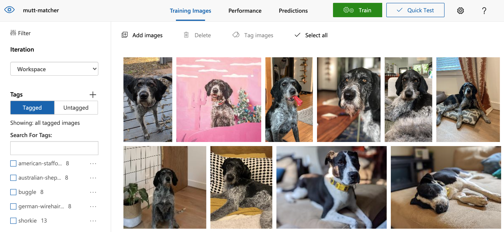

# Build a Machine Learning Model using Azure Custom Vision

## Overview

Azure [Custom Vision](https://docs.microsoft.com/azure/cognitive-services/custom-vision-service/?wt.mc_id=studentamb_211042) allows you to create models which can classify and detect items in images. You could use this to detect a breed of dog, if someone is wearing a helmet, or the presence of other features. While this could be done by using code and manually processing the images, Custom Vision provides a web-based interface and tooling to streamline the process. No prior knowledge of machine learning or math is required!
This repository is about building a model to detect dog breeds. 

## What you'll build with CustomVision.ai



## Prerequisites

### Git

This workshop assumes core knowledge of Git, specifically the ability to clone a repository. During the workshop you will download the code from GitHub. You will need either [Git](https://git-scm.com/) to clone the repository.

### Python 3.8 or greater, including pip

You will build a project using Python. Basic knowledge of Python is assumed, specifically the ability to import packages and use `open` and `with`. You will also need Python installed locally. To test if you have Python and pip installed, open a command or terminal window and run the following commands.

```bash
python3 --version
```
```bash
pip3 --version
```
If Python and pip are installed a version number will be displayed, such as *3.8.10*. Otherwise, an error message is displayed. You can install Python and pip as needed:

- [Windows](https://docs.microsoft.com/windows/python/beginners?wt.mc_id=studentamb_211042#install-python)
- [MacOS](https://www.python.org/downloads/macos/)
- [Linux](https://packaging.python.org/guides/installing-using-linux-tools/)

### Visual Studio Code

The instructions for this workshop assume you are using [Visual Studio Code](https://code.visualstudio.com?wt.mc_id=studentamb_211042), an open source code editor. You will also need the [Pylance extension](https://marketplace.visualstudio.com/items?itemName=ms-python.vscode-pylance&wt.mc_id=studentamb_211042), which will provide additional functionality when writing Python.

## In This workshop: 

- [Part 0: Install and configure tools]
- [Part 1: Train your model]
- [Part 2: Test your model]

# Part 0: Install and configure tools

As with any project, a few tools are going to be needed. In particular you'll need a code editor, an Azure subscription, and a couple of keys for Custom Vision.

## Installing the editor

Visual Studio Code is an open source code editor which can be used to create nearly any project type with any programming language. If you don't already have Visual Studio Code installed, you can install it by visiting [code.visualstudio.com](https://code.visualstudio.com/?wt.mc_id=studentamb_211042). You will also need the [Pylance extension](https://marketplace.visualstudio.com/items?itemName=ms-python.vscode-pylance&wt.mc_id=studentamb_211042), which will provide additional functionality when writing Python.

## Obtaining the starter project

A starter project has been provided which includes the images for the workshop and the solution code. To obtain the project:

1. Navigate to [https://github.com/alshubati99/custom-vission-MLmodel/](https://github.com/alshubati99/custom-vission-MLmodel)

2. Open a terminal or command window and execute the following, replacing \<URL\> with the URL you copied in the prior step

    ```bash
    # Windows,Linux, WSL or macOS:
    git clone <URL>
    cd custom-vission-MLmodel.
    ```

## Enrolling with Azure for Students

Azure for Students offers $100 US in free credit to be used across 12 months and a host of free services - including Custom Vision! If you don't already have an Azure subscription, you can enroll with [Azure for Students](https://azure.microsoft.com/free/students/?wt.mc_id=studentamb_211042) by using your school email address. If your email address doesn't work, please ask your instructor for a code.

## Creating keys

To use Custom Vision, you'll need two keys:

- a training key, used to create the model
- a prediction key, used to make predictions based on the model

We'll create these keys by using the Azure portal.

1. Navigate to [portal.azure.com](https://portal.azure.com)
1. Select **Create a resource**
1. Search for **Custom Vision** and press enter
1. Select **Custom Vision** from the list of services
1. Select **Create**
1. For **Create Options** ensure **Both** is selected
1. Under **Project Details** configure the following:
    1. For **Subscription** select your Azure for Students subscription
    1. For **Resource Group** select **Create new**, enter **custom-vision** for the name, and select **OK**
1. Under **Instance Details** configure the following:
    1. For **Region** select a region near you
    1. For **Name**, provide a unique name such as **custom-vision-your-name**, replacing **your-name** with your name
1. For both **Training pricing tier** and **Prediction pricing tier** select **Free F0**
1. Select **Review + create**
1. Select **Create**
# Part 1: Train your model

A custom vision model 

## Create the project

A project is a custom vision model. It's used to label images with the appropriate tag (or category), and perform the training. Let's start by creating a project.

1. Navigate to [Custom Vision](https://www.customvision.ai?wt.mc_id=studentamb_211042) and sign in
1. Select **New Project**
1. Enter **Dog Classification** for the project name
1. Next to Resource, select the key you created earlier, which will use the name you created during the set up. 
1. For **Project Types** select **Classification**
1. For **Classification Types** select **Multiclass**, as our dogs will only have one breed
1. For **Domains** select **General \[A2\]**
1. Select **Create project**

## Upload images

Once the project is created it's time to upload images. These images are used to train the model.

> **Tip**: As a general rule, the more images you can use to train a model the better. You want to include as much variety in the images as possible, including different lighting, angles, and settings.

1. Select **Add images**
1. Navigate to **training-images**
1. Select all the images marked as **american-staffordshire-terrier** in the folder, and select **Open**
1. Enter **american-staffordshire-terrier** for the tag and select **Upload 8 files**
1. Select **Done**
1. Repeat the above steps for the remaining breeds:
    - **australian-shepherd**
    - **buggle**
    - **german-wirehaired-pointer**
    - **shorkie**
1. Select **Train** to open the training dialog
1. Leave **Quick Training** selected and select **Train** to begin the training process

> **Note**: Training the model will take a couple of minutes.
# Part 2: Use the model

With the model trained it's time to turn our attention to using it. We'll start by testing it in the Custom Vision website. Then we'll explore how we can call the model from code by using an SDK.

## Test the model

Let's see how well our model works. It's important to use images which weren't used to train the model. After all, if the model has already seen the image it's going to know the answer.

1. Select **Quick Test**
1. Select **Browse local files**
1. Navigate to **testing-images** and select one of the dog images
1. Select **Open**
1. Notice the **tag** and **probability** scores

## Publish model

The goal of creating a model in Custom Vision is to use it in different applications. To access it from outside of the Custom Vision website it needs to be published.

1. In the 'Performance' tab, select **Publish**
1. For **Model name** enter **dogs**
1. For **Prediction resource** select the prediction key you created earlier.
1. Select **Publish**
1. Select **Prediction URL** to view the endpoint address
1. Copy the value in the grey textbox under **If you have an image file** and paste it somewhere locally where you can find it later
1. Select **Got it**

## Obtain keys and values

As with any service, we need to gather the keys and values to make our calls. You'll want to copy these keys into a text file; they'll be used in the next step.

1. From the **Performance** screen, select **Prediction URL**
1. Copy the URL under **If you have an image file**; this will be used to create the endpoint
1. Copy the hex value for the **Prediction-Key**. It will look similar to: *ba81ed4539cd46ec979a98569035a463*
1. Select **Got it** to close the window
1. In the upper right corner of the Custom Vision interface, select the **Gear** icon for settings
1. Copy the **Project Id** value

> TIP: **Project Id** is the value on the left side of the screen

### Create the endpoint value

The SDK for Custom Vision uses a slightly different URL than the one you copied earlier. The value you copied will look something like the following:

> `https://customvisionworkshop-prediction.cognitiveservices.azure.com/customvision/v3.0/Prediction/0dd3299b-6a41-40fe-ab06-dd20e886ccd4/classify/iterations/Iteration1/image`

To create the endpoint value, remove everything after **azure.com**. Your endpoint value should look like this:

> `https://customvisionworkshop-prediction.cognitiveservices.azure.com/`

## Store the necessary credentials

Whenever you're writing code it's a best practice to never hard-code sensitive values, such as passwords, or any value which may change. This can lead to security breaches or code that's difficult to maintain. To create our application we're going to follow generally accepted best practices. To do this we'll use a library named [python_dotenv](https://github.com/theskumar/python-dotenv), which allows you to set environment variables with a text file.

1. Return to Visual Studio Code
1. In this project's root folder, create a new file named **.env**
1. Add the following values, replacing the placeholders

    ```bash
    ENDPOINT=<YOUR_ENDPOINT>
    KEY=<YOUR_PREDICTION_KEY>
    PROJECT_ID=<YOUR_PROJECT_ID>
    PUBLISHED_ITERATION_NAME=dogs
    ```

1. Save the file by selecting **File** > **Save**

## Install the packages

We'll be using two Python packages to support our project. The first we already introduced, **python-dotenv**. The next is the [Custom Vision client library (or SDK)](https://docs.microsoft.com/azure/cognitive-services/custom-vision-service/quickstarts/image-classification?tabs=visual-studio&pivots=programming-language-python&wt.mc_id=studentamb_211042), which you'll use to  make the predictions.

1. Create a new file named **requirements.txt**
1. Inside **requirements.txt**, add the following:

    ```bash
    python-dotenv
    azure-cognitiveservices-vision-customvision
    ```

1. Save the file by selecting **File** > **Save**
1. Open a new terminal window inside Visual Studio Code by selecting **Terminal** > **New Terminal Window**
1. Create a new Python environment and install the packages by running the following command:

    ```bash
    # On Windows
    python3 -m venv venv
    .\venv\Scripts\activate
    pip install -r requirements.txt
    ```
     ```bash
    # On Linux, WSL or macOS
    python3 -m venv venv
    source venv/bin/activate
    pip install -r requirements.txt
    ```

1. The packages will install.

## Create the program

With the setup work done, it's time to add your code! We'll break this down into a few sections.

1. Create a new file named **predict.py**

### Import the libraries

Most Python applications start by importing the required libraries, and our program will follow the same pattern.

1. Inside **predict.py**, add the following to import the necessary libraries:

    ```python
    # Prediction client
    from azure.cognitiveservices.vision.customvision.prediction import CustomVisionPredictionClient
    # Key class for azure
    from msrest.authentication import ApiKeyCredentials
    # dotenv to load key
    from dotenv import load_dotenv
    # Import os to read environment variables
    import os
    ```

### Load the variables

Earlier we setup a few environment variables like our key and endpoint. Let's load those into memory.

1. At the end of **predict.py**, add the following code to load the environment variables

    ```python
    # Load the key and endpoint values
    load_dotenv()
    
    # Set the values into variables
    key = os.getenv('KEY')
    endpoint = os.getenv('ENDPOINT')
    project_id = os.getenv('PROJECT_ID')
    published_name = os.getenv('PUBLISHED_ITERATION_NAME')
    ```

### Perform the prediction

Now we can perform our prediction! We'll be using one of the images in the testing folder.

1. At the end of **predict.py**, add the following code to perform a prediction of dog breed

    ```python
    # Setup credentials for client
    credentials = ApiKeyCredentials(in_headers={'Prediction-key':key})
    
    # Create client, which will be used to make predictions
    client = CustomVisionPredictionClient(endpoint, credentials)
    
    # Open the test file
    with open('testing-images/american-staffordshire-terrier-10.jpg', 'rb') as image:
        # Perform the prediction
        results = client.classify_image(project_id, published_name, image.read())
    
        # Because there could be multiple predictions, we loop through each one
        for prediction in results.predictions:
            # Display the name of the breed, and the probability percentage
            print(f'{prediction.tag_name}: {(prediction.probability):.2%}')
    ```

## Run the program

With the program created, let's run it and see what happens!

1. Save all files by selecting **File** > **Save All**
1. Return to the terminal inside Visual Studio Code by selecting **View** > **Terminal**
1. Run the following command to execute the program

    ```bash
    python predict.py
    ```

1. You should now see the following output:

    ```bash
    american-staffordshire-terrier: 97.11%
    german-wirehaired-pointer: 1.46%
    australian-shepherd: 0.97%
    buggle: 0.46%
    shorkie: 0.00%
    ```

    > **Note**: Your percentages may not exactly match those above


